# Movie App 📱

## 📸 Screenshots

  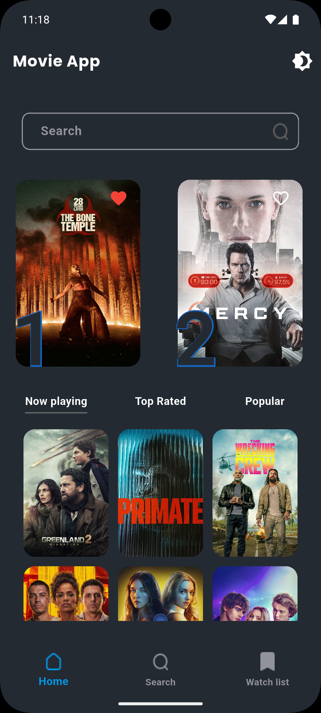
  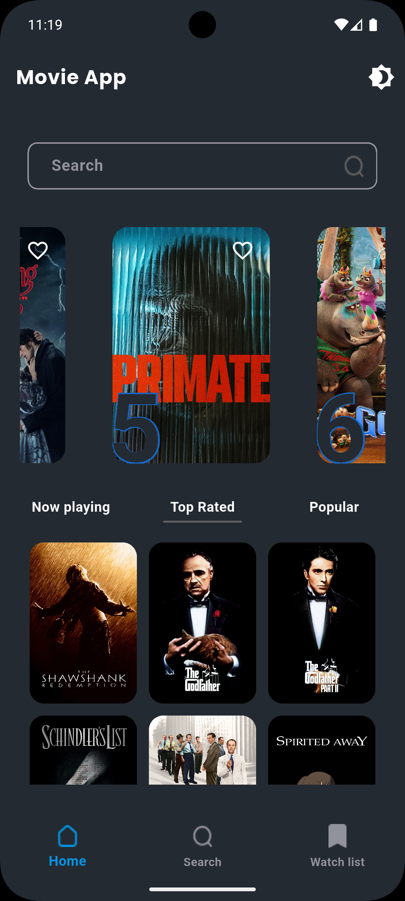
  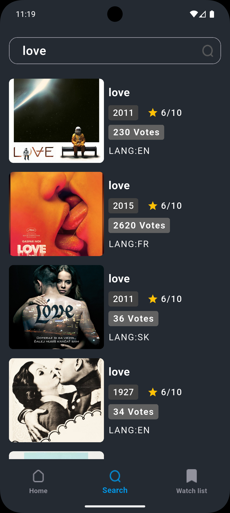
  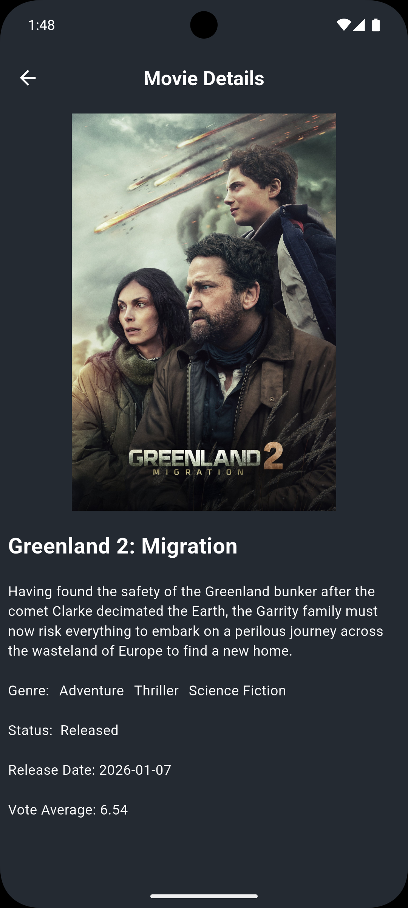
  
  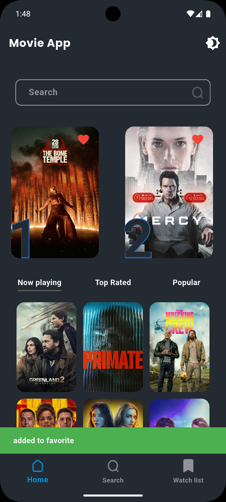
  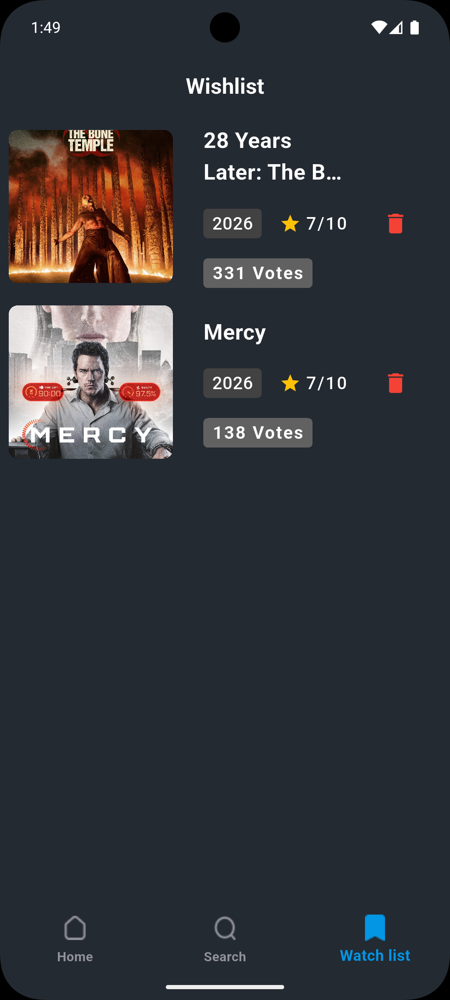
  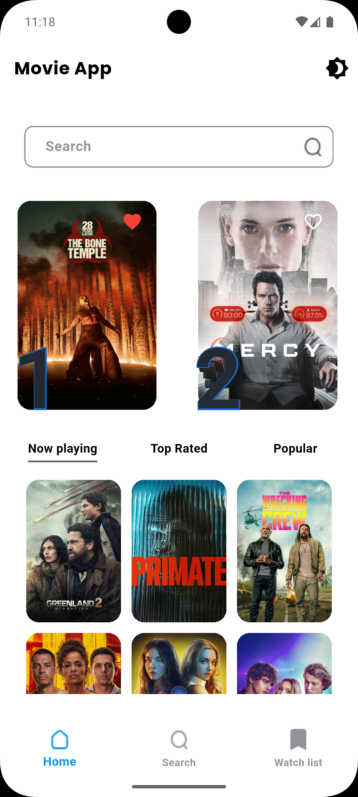
  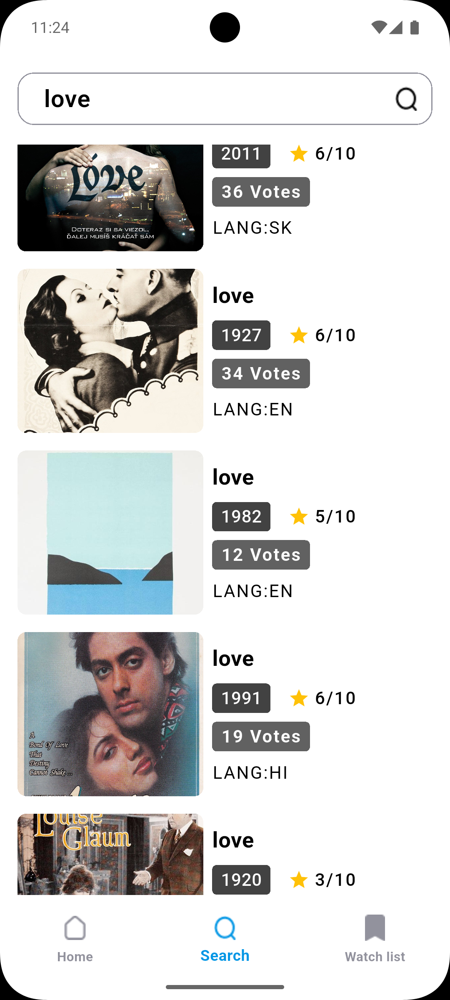
  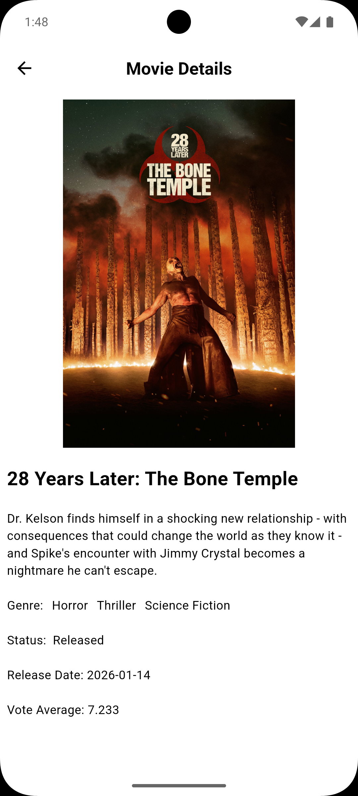
  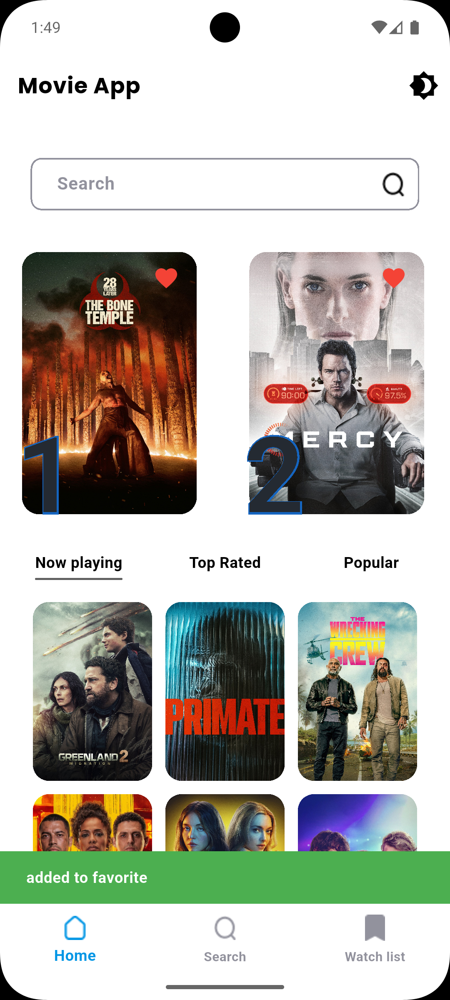
  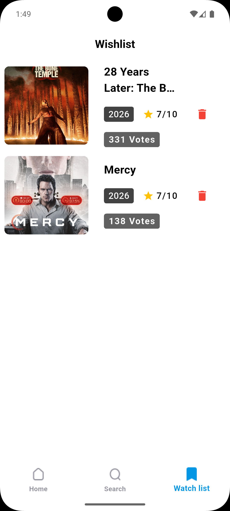

## ✨ Features
- Add & delete movies
- Dark mode support
- Light mode support
- Local database storage
- Clean UI
-  Movie Search
- Movie Details

## Main packages used
- dio to make integration with API
- flutter_bloc as state management
- shared_preferences to handle caching data
- internet_connection_checker to handle internet connection
- get_it to make dependency injection
- dartz to Functional programming in Dart
- equatable to Simplify Equality Comparisons

## 🛠 Built With
- Dart
- Flutter
- MVVM
- Clean Architecture
- Clean Code

## 👨‍💻 Developer
Mahmoud Diab